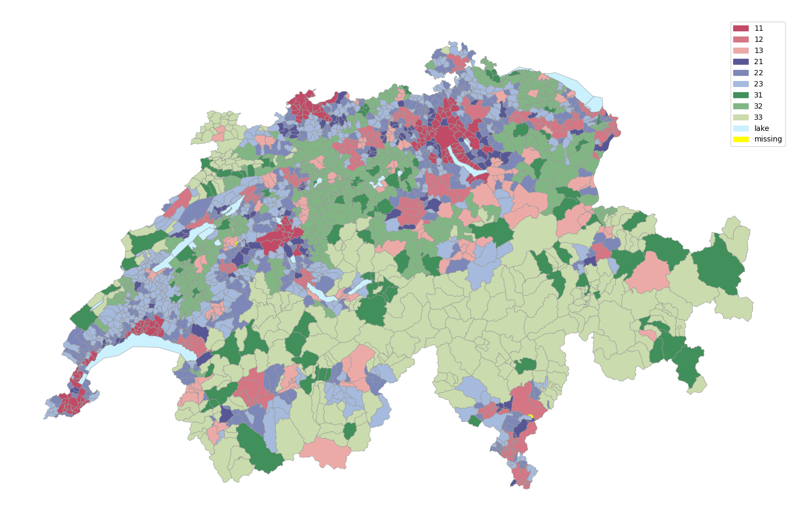

# Swiss Municipalities

Small utility that helps to determine in
which [municipality](https://en.wikipedia.org/wiki/List_of_municipalities_of_Switzerland) lies a given coordinate in
Switzerland and can also give it's typology -- e.g. agglomeration / rural area etc. The underlying data was obtained
from the websites of:

- [Bundesamt für Landestopografie](https://shop.swisstopo.admin.ch/de/products/landscape/boundaries3D)
- [Bundesamt für Statistik](https://www.atlas.bfs.admin.ch/maps/13/de/12360_12482_3191_227/20593.html)

## Missing Data

For some municipalities we have missing data about the typology, you can check the state of the missing values on the
map below.
